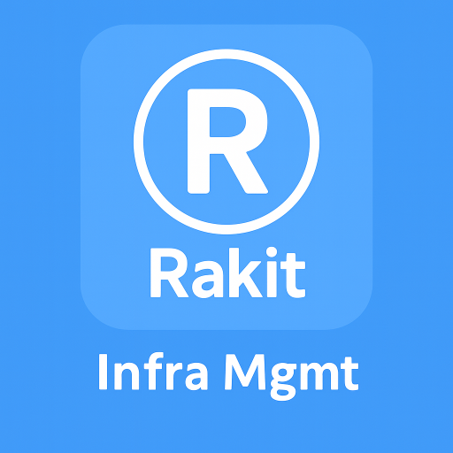
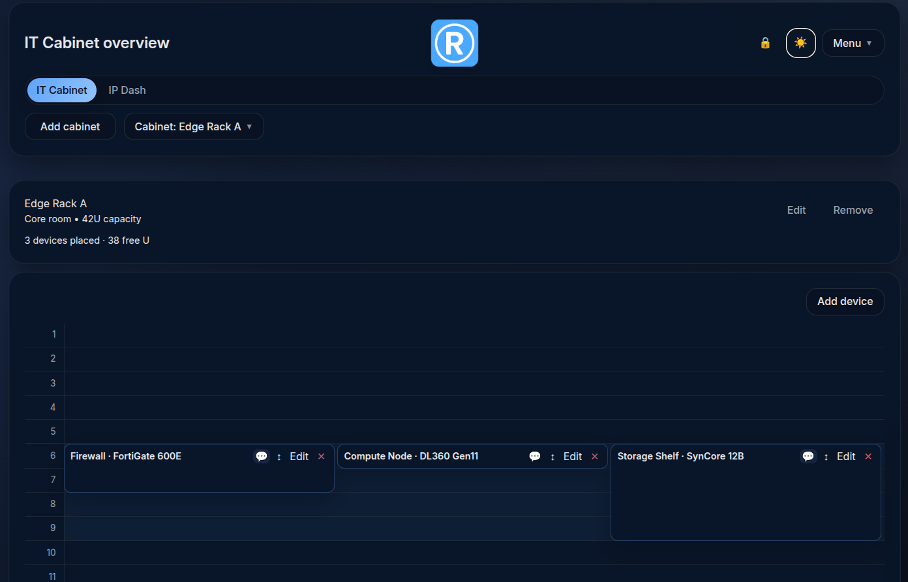
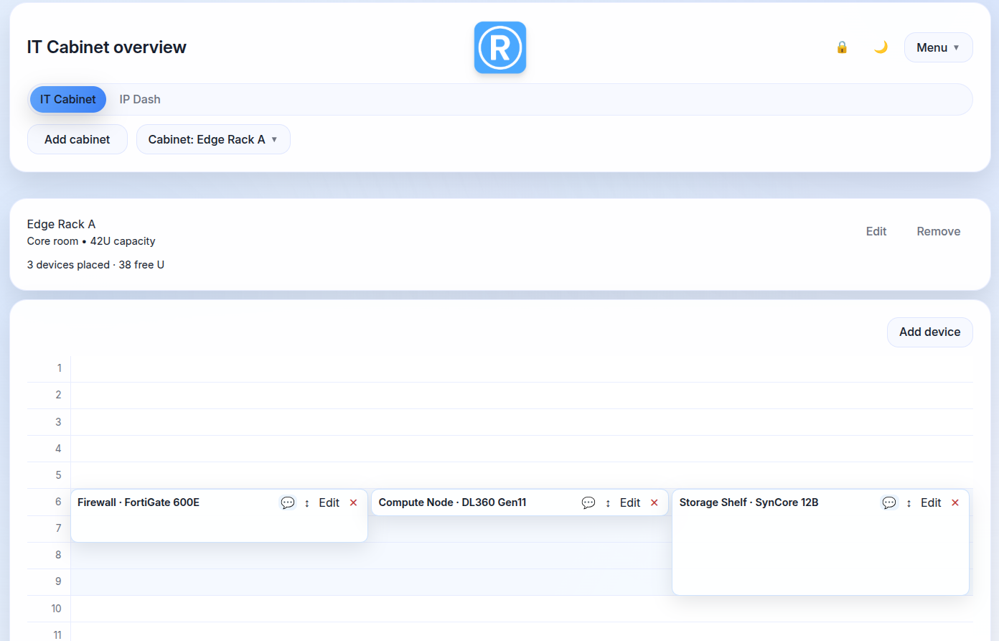
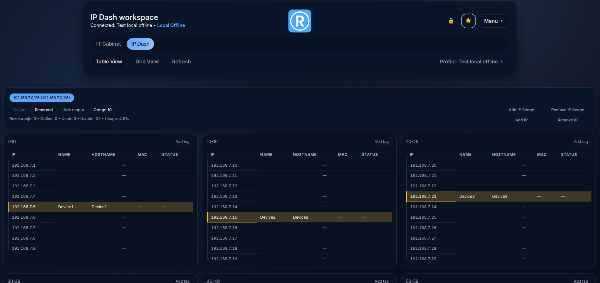
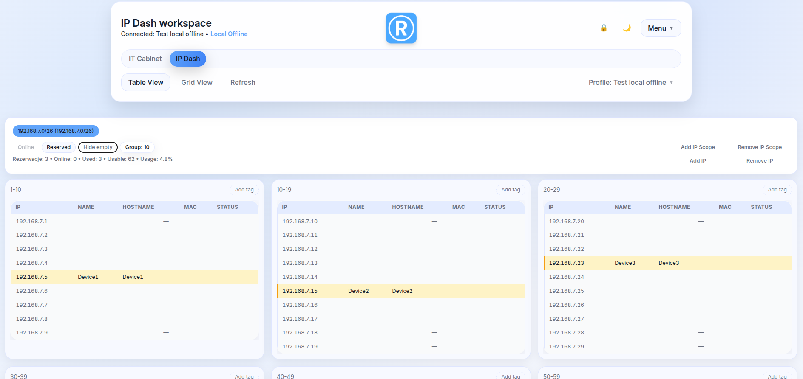
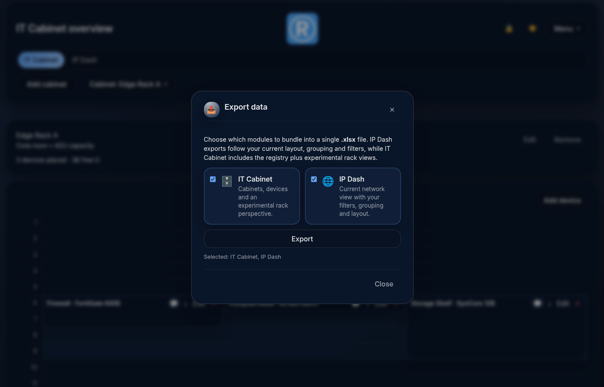
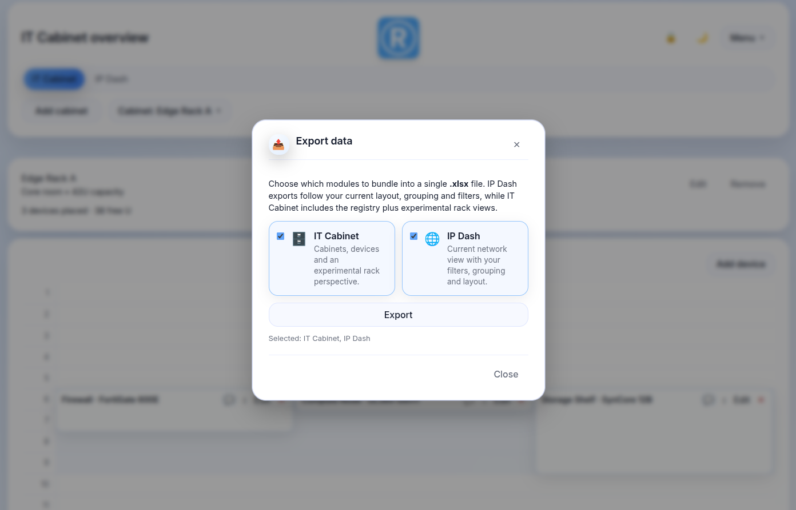
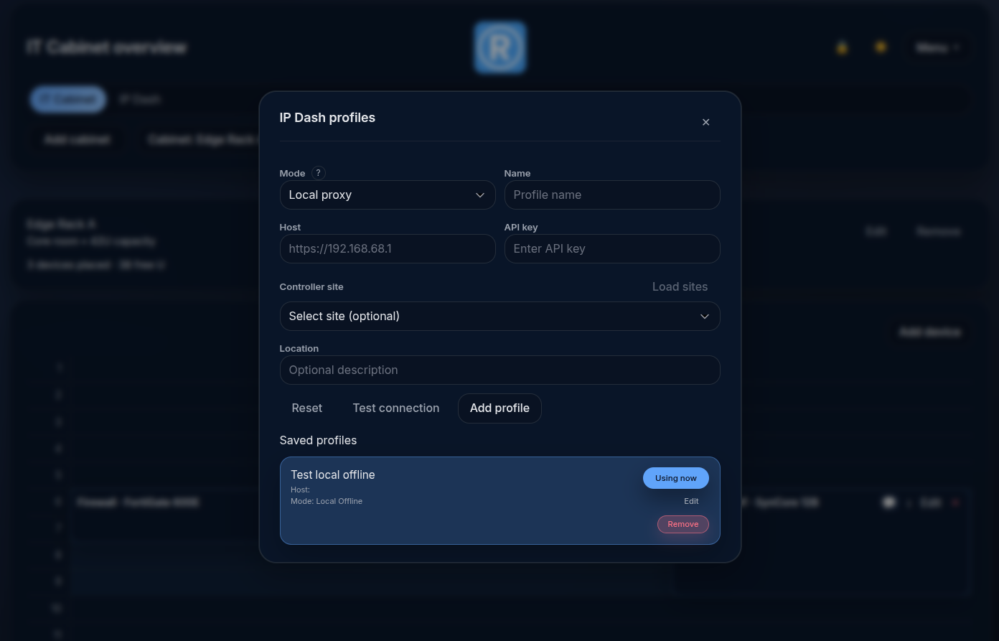
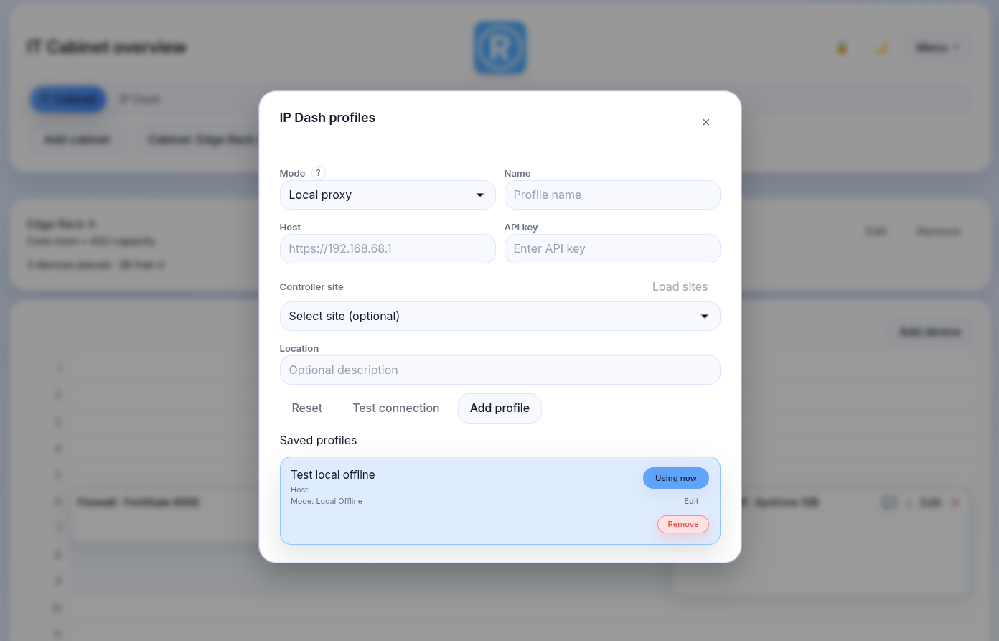

# RAKIT

<p align="center">
  
</p>


**RAKIT** is a self-hosted dashboard for IT ops. Manage Your IP reservations offline or read it via Unifi API directly from Your Unifi stack. Visualize, manage and plan Your IT Cabinets. Export data at any time.

- ✅ Modern UI (React + Vite + Tailwind)
- ✅ Backend API (Node.js)
- ✅ PWA – works offline and behaves like a native app
- ✅ Manage multiple IT rack cabinets
- ✅ Manage IP reservations including entire IP scopes
- ✅ Designed for self-hosting (Docker, docker-compose, reverse proxy friendly)
- ✅ Secured with encryption key

---
## Demo / Screenshots

### Main UI
<p align="center">
  
  
</p>
<p align="center">
  
  
</p>

### Export data
<p align="center">
  
  
</p>

### Profiles management
<p align="center">
  
  
</p>


---

## Features

- Manage **IT Cabinets**
- Manage **IP Reservations**
- Read IPs info directly from **Unifi API integration**
- Add, edit, and delete **API connection profiles**
- Generate **export data**
- **PIN guard** built-in (secure access)
- **Offline** mode (PWA, cache zasobów)
- **Data encryption** - your API keys are secured with encryption key

---

## Run with Docker (GHCR)

The easiest way to get started is to use compose file:

```bash
services:
  rakit:
    image: ghcr.io/pbuzdygan/rakit:latest
    container_name: rakit
    restart: unless-stopped

# Network mode for Rakit - recommended for using all Rakit API's integrations
    network_mode: host
    
# Rakit backend/frontend listens on port 8011 inside the container
# Not required in "network_mode host"
#    ports:
#      - "8011:8011"

# Persistent data (if backend writes anything to /data)
    volumes:
      - ./data:/data

# Environment variables
    environment:
      - PORT=8011 #in network_mode host You can set different than default port
      - DB_FILE=/data/rakit.sqlite
      - APP_PIN=REPLACE_WITH_YOUR_PIN #PIN 4-8 digits
      - APP_ENC_KEY=REPLACE_WITH_YOUR_KEY
      - NODE_ENV=production

```
### Generate Your APP_ENC_KEY

Result of below command is Your encryption key - stored it securley - without it, Your Rakit will not start and Your API connection profiles will be lost.

```bash
openssl rand -base64 32

```

## Buy Me a Coffee
If You like results of my efforts, feel free to show that by supporting me.

[](https://www.buymeacoffee.com/pbuzdygan)
<p align="left">
  
</p>
