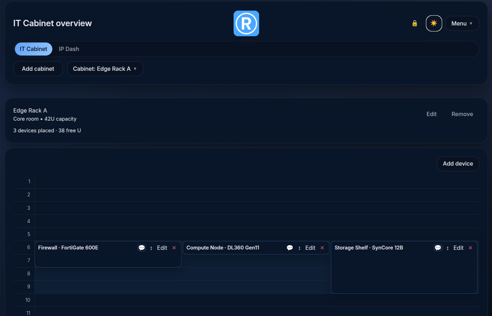
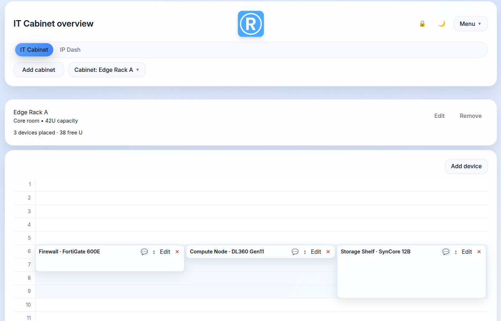
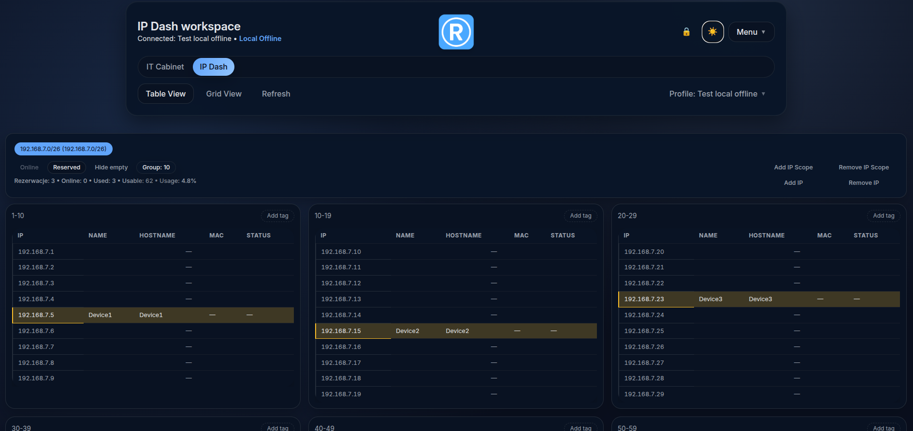
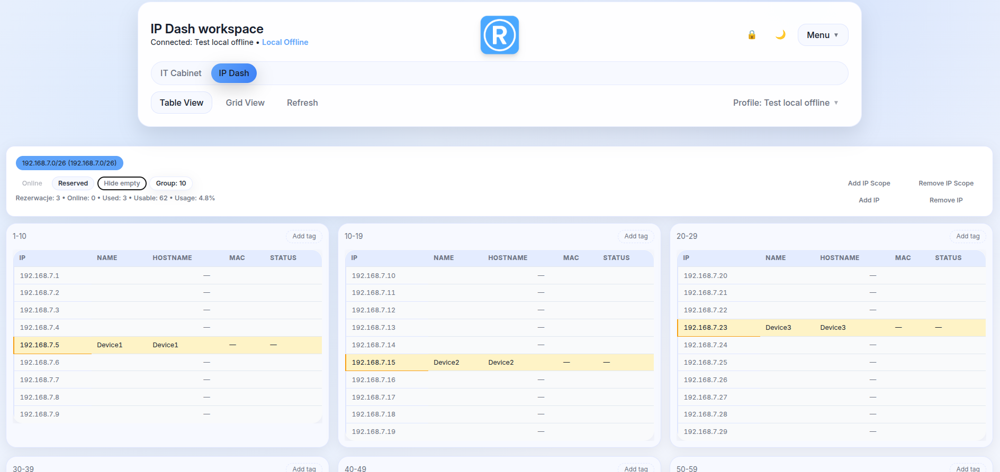
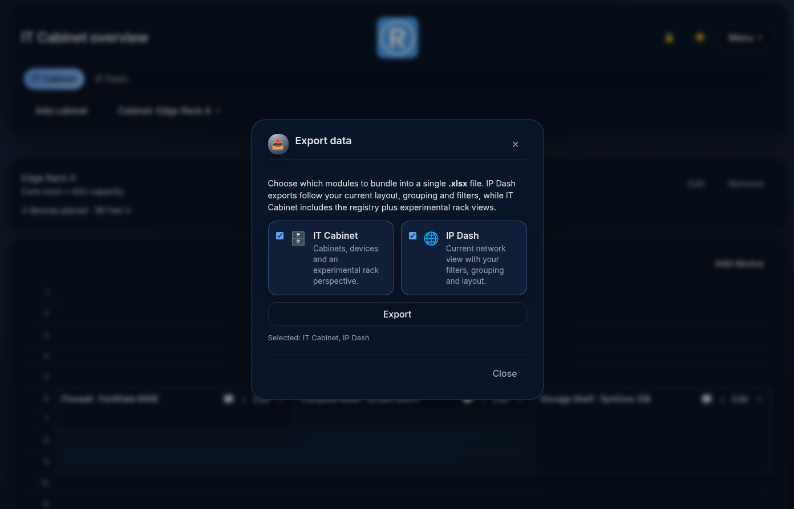
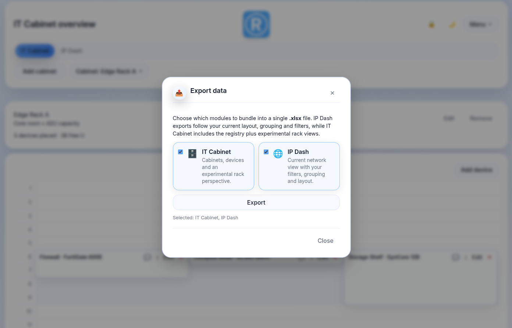
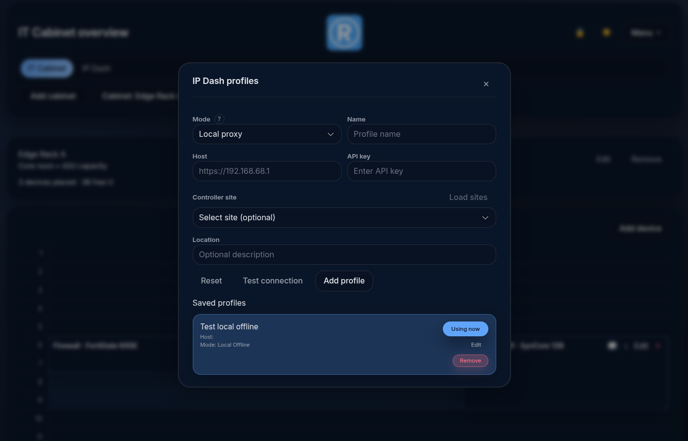
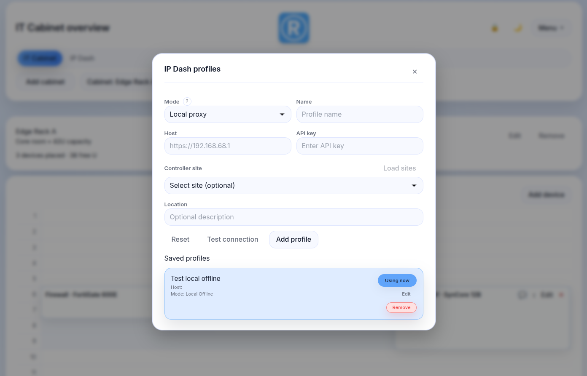

# RAKIT

<p align="center">
  
</p>


**RAKIT** is a self-hosted dashboard for IT ops. Manage Your IP reservations offline or read it via Unifi API directly from Your Unifi stack. Visualize, manage and plan Your IT Cabinets. Export data at any time.

- ✅ Modern UI (React + Vite + Tailwind)
- ✅ Backend API (Node.js)
- ✅ Installable PWA – standalone launch with an offline application shell
- ✅ Manage multiple IT rack cabinets
- ✅ Manage IP reservations including entire IP scopes
- ✅ Designed for self-hosting (Docker, docker-compose, reverse proxy friendly)
- ✅ Secured with encryption key

---
## Demo / Screenshots

### Main UI
<p align="center">
  
  
</p>
<p align="center">
  
  
</p>

### Export data
<p align="center">
  
  
</p>

### Profiles management
<p align="center">
  
  
</p>


---

## Features

- Manage **IT Cabinets**
- Manage **IP Reservations**
- Read IPs info directly from **Unifi API integration**
- Add, edit, and delete **API connection profiles**
- Generate **export data**
- **PIN guard** built-in (secure access)
- **Installable PWA** with a cached application shell (infrastructure data and actions remain online-only)
- **Data encryption** - your API keys are secured with encryption key

---

## Run with Docker (GHCR)

The easiest way to get started is to use compose file:

```bash
services:
  rakit:
    image: ghcr.io/pbuzdygan/rakit:latest
    container_name: rakit
    restart: unless-stopped
    user: "1000:1000"
    read_only: true
    cap_drop: [ALL]
    security_opt: [no-new-privileges:true]
    pids_limit: 128
    tmpfs:
      - /tmp:rw,noexec,nosuid,nodev,size=64m

# Network mode for Rakit - recommended for using all Rakit API's integrations
    network_mode: host
    
# Rakit backend/frontend listens on port 8011 inside the container
# Not required in "network_mode host"
#    ports:
#      - "8011:8011"

# Persistent data (if backend writes anything to /data)
    volumes:
      - ./data:/data

# Environment variables
    environment:
      - PORT=8011 #in network_mode host You can set different than default port
      - DB_FILE=/data/rakit.sqlite
      - APP_PIN=${APP_PIN:?APP_PIN must be set in .env}
      - APP_ENC_KEY=${APP_ENC_KEY:?APP_ENC_KEY must be set in .env}
      - APP_SESSION_TTL_MINUTES=480
      - APP_MAX_SESSIONS=256
      - APP_PIN_ATTEMPT_LIMIT=5
      - APP_PIN_ATTEMPT_WINDOW_MINUTES=15
      - APP_PIN_BLOCK_MINUTES=15
      # Set true only when the UI is served through HTTPS.
      - APP_COOKIE_SECURE=false
      - TZ=Europe/Warsaw #IANA time zone for displayed dates and WOL schedules
      # Optional: remove audit events older than N days (unset/0 keeps all events)
      # - AUDIT_RETENTION_DAYS=365
      # Optional WOL reachability tuning (milliseconds)
      # - WOL_PROBE_TIMEOUT_MS=1200
      # - WOL_STATUS_CACHE_MS=20000
      - NODE_ENV=production

```

Copy `.env.example` to `.env`, set a 4–8 digit `APP_PIN` and generate `APP_ENC_KEY` before the first start. Compose does not read a variable merely because it exists in `.env`; the Compose service must reference it as `${APP_PIN}`. The supplied Compose files use required interpolation and stop with a clear configuration error if either secret is missing.

```bash
cp .env.example .env
openssl rand -base64 32
docker compose --env-file .env up -d --force-recreate
```

Paste the generated key and your PIN into `.env` before running the final command. For the local development Compose file, use `docker compose --env-file .env -f local-build-docker-compose.yml up -d --build --force-recreate`.

The runtime process uses UID/GID 1000. Prepare the persistent directory before the first start (and once after upgrading an older root-based installation):

```bash
mkdir -p data
sudo chown -R 1000:1000 data
```

`network_mode: host` remains the default because Wake-on-LAN broadcasts depend on it in the current implementation. Restrict access to the configured Rakit port with the host firewall.

Rakit stores database timestamps in UTC and converts them for display using `TZ`. After changing `TZ`, recreate the container (a restart of the existing process is not sufficient for a changed Compose definition):

```bash
docker compose up -d --force-recreate
```

### Generate Your APP_ENC_KEY

The command below generates an encryption key. Store it securely and keep it unchanged: existing UniFi API profiles cannot be decrypted with a different key. Compose placeholder values are rejected. Older short keys remain accepted for backward compatibility and produce a warning; do not replace an existing key without first planning a reset of encrypted profiles.

```bash
openssl rand -base64 32

```

After a correct PIN, Rakit creates a time-limited server session in an `HttpOnly`, `SameSite=Strict` cookie. Repeated invalid PIN attempts are temporarily blocked. When Rakit is behind an HTTPS reverse proxy, set `APP_COOKIE_SECURE=true`; optionally set `TRUST_PROXY=true` and `APP_ORIGIN=https://rakit.example.com`.

### Install Rakit as a PWA

PWA installation and the service worker require a secure browser context. Publish Rakit through an HTTPS reverse proxy and open that HTTPS address on the target device. `http://localhost` and `http://127.0.0.1` are accepted for local development, but a plain LAN address such as `http://192.168.1.20:8011` is not installable as a PWA.

For an HTTPS deployment, use settings such as:

```yaml
environment:
  - APP_COOKIE_SECURE=true
  - TRUST_PROXY=true
  - APP_ORIGIN=https://rakit.example.com
```

Rakit caches only the application shell, icons, fonts and built frontend assets. Authenticated API responses, PIN sessions and infrastructure data are deliberately excluded from browser cache storage. The installed app can therefore show its login shell without the server, but viewing or changing data requires a connection to Rakit.

UniFi TLS certificates are verified by default. Rakit also reads CA certificates trusted by the container operating system. For a trusted local controller with a self-signed certificate, enable the explicit **Allow self-signed controller certificate** option only for that profile.

The safer alternative for a controller signed by a private CA is to mount the CA bundle read-only and set `NODE_EXTRA_CA_CERTS` to its path, for example:

```yaml
services:
  rakit:
    environment:
      - NODE_EXTRA_CA_CERTS=/certificates/unifi-ca.pem
    volumes:
      - ./certificates/unifi-ca.pem:/certificates/unifi-ca.pem:ro
```

Recreate the container after changing certificate settings. `NODE_EXTRA_CA_CERTS` is read only when Node.js starts.

Controller responses are size-limited and loopback/link-local/reserved targets are blocked. Private LAN addresses remain available. If UniFi intentionally runs on the same host as Rakit, set `IP_DASH_ALLOW_LOOPBACK=true`; do not enable this for controller addresses supplied by untrusted users.

## Buy Me a Coffee
If You like results of my efforts, feel free to show that by supporting me.

[](https://www.buymeacoffee.com/pbuzdygan)
<p align="left">
  
</p>
